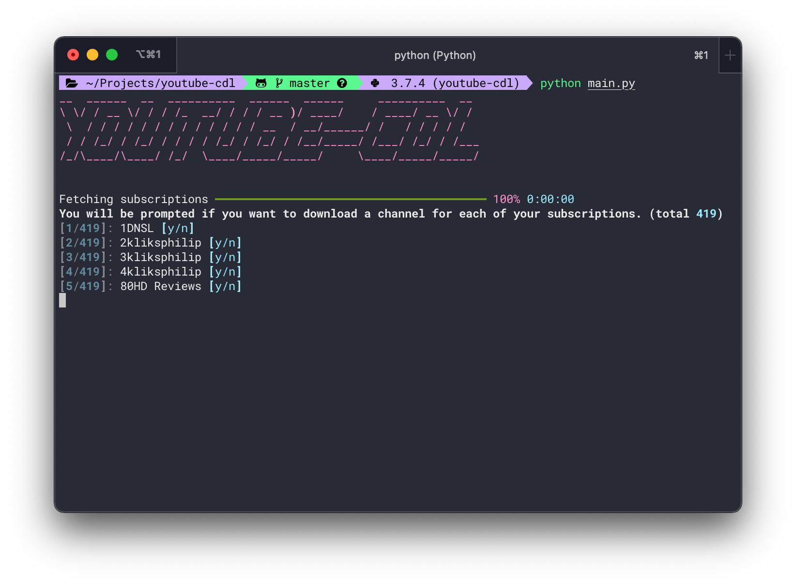

# youtube-cdl
*Command line tool based on youtube-dl to easily download selected channels from your subscriptions.*



This tool is very handy if you want to hoard a lot of videos, but not all of them.

## Setup:

1. Clone repo & install dependencies:
```bash
git clone https://github.com/anatolykopyl/youtube-cdl.git
cd youtube-cdl
pip install -r requirements.txt
# If on windows instead run
# pip install -r windows.txt
```
2. Create or select a project in the [API Console](https://console.developers.google.com/). 
Complete the following tasks in the API Console for your project:
    
    1. In the [library panel](https://console.developers.google.com/apis/library), 
    search for the YouTube Data API v3. Click into the listing for that API and make 
    sure the API is enabled for your project.

    2. In the [credentials panel](https://console.developers.google.com/apis/credentials), create an **OAuth client ID.** 
            
        This will need you to configure your consent screen:

        * Only "App name", "User support email" and "Developer contact email" fields are required. 
        * On "Test users" step add yourself (your email address).

        After you've set up your consent screen go back to the "Credentials" tab
        and create OAuth Client ID credentials.

        Set the application type to Desktop App.

        Download the JSON file that contains your OAuth 2.0 credentials. The file 
        has a name like client_secret_CLIENTID.json, where CLIENTID is the client ID 
        for your project.

3. Rename the downloaded file to `client_secrets.json` and put it in the project root.

4. Run the script:
```bash
python main.py
```

## Usage:

* Run the script and go through your subscriptions one by one:
```bash
python main.py
```

* Specify format [like in youtube-dl](https://github.com/ytdl-org/youtube-dl#user-content-format-selection-examples):
```bash
python main.py -f 'bestaudio/best'
```

* Download all the videos from all channels you're subscribed to:
```bash
python main.py -a
```

* Download into a specified directory:
```bash
python main.py -o path/to/dir
```

When you go through all of your subscriptions and mark all of them as `y/n` your selections 
will be saved in `download_list.json`. 

If for some reason you stopped the script, you can 
continue downloading without going through all of your subscriptions again by running 
`python main.py -i download_list.json`. 

Or if you made a mistake while going through the channels you can just edit `download_list.json` 
and rerun with it passed as an argument.
